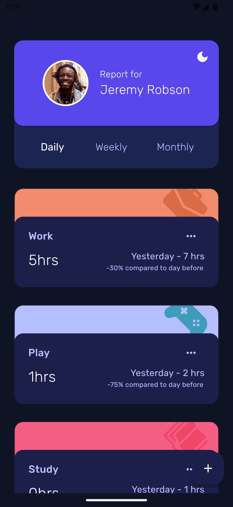
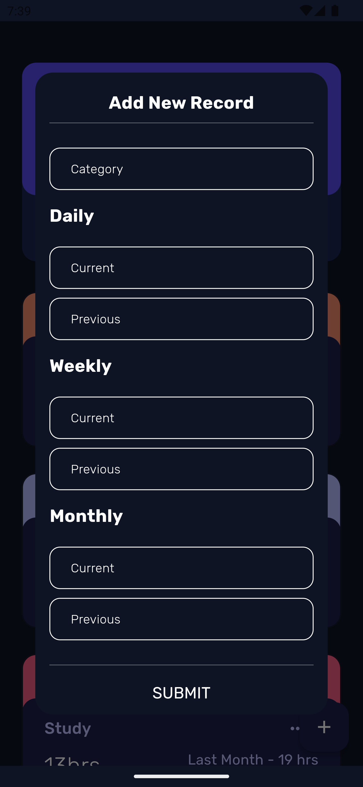

# aidHere Time Tracker 

## Functionality 

Fetches user records from API for first launch, caches it and allows user to add more records or update previous records. 

- Allows the user to view the reports for different periods i.e. Daily, Weekly and Monthly.

- Allows user to switch between dark mode and light mode

        After First restart, mock data for the day before yesterday is added, user can see the records and trends for the last three days. 

## **Implementation**

Implemented using BLoC Cubit as state management with HydratedCubit to allow local storage. 

Freezed generator is used to generate models and cubits. This helps us with immutability and easy state handling. 

Dio is used for API requests. 

## **Cubits**
---
### App Cubit

This is used for handling the darkMode configuration and stores user preference after the app closes. 

---
### Tracker Cubit 

This cubit fetches user records from the API, saves them to local storage for later usage, mocks user data for the day before on app relaunch. 

---
## **Repository**

Handles the API request handling, initialized within the Tracker cubit. 

--- 

## **Architecture**

CLEAN BLoC Architecture, 

- Core 
    - Constants  -- App Constant values
    - Models  -- Entities
- Domain
    - API
    - Cubits
    - Repository 
- UI 
    - Home Screen 
        - widgets/ -- Subwidgets for the parent screen. 
    - widgets/ -- Sub-Widgets for the App

---
## **Testing**

BLoC Test added for both Cubits. 